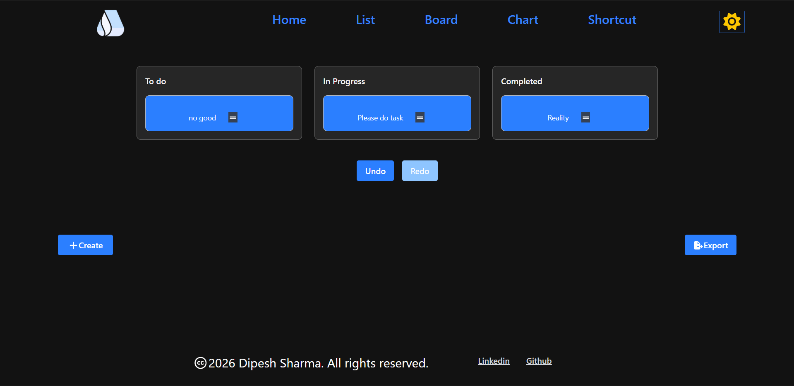
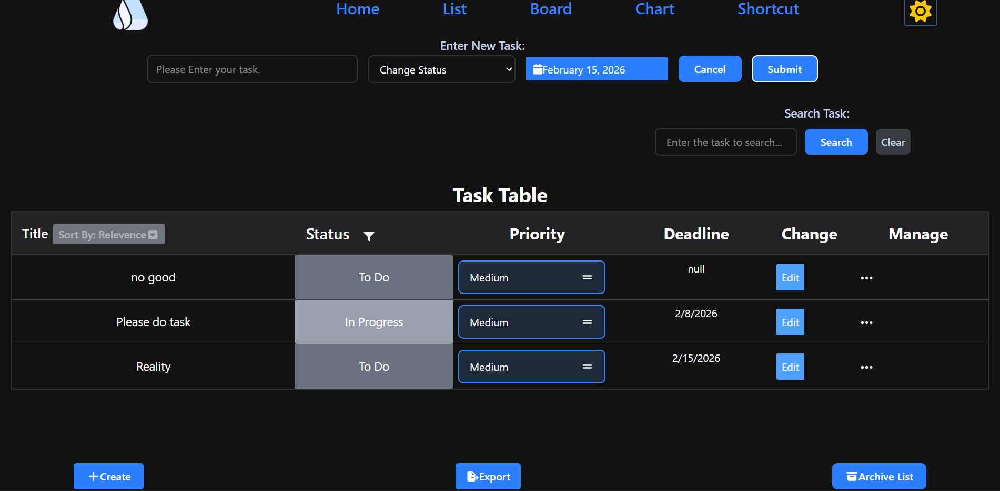
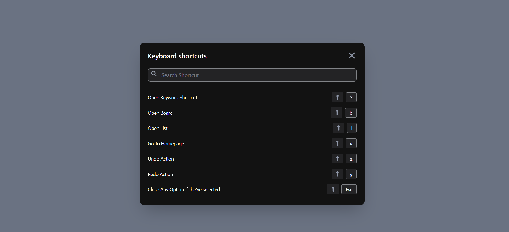
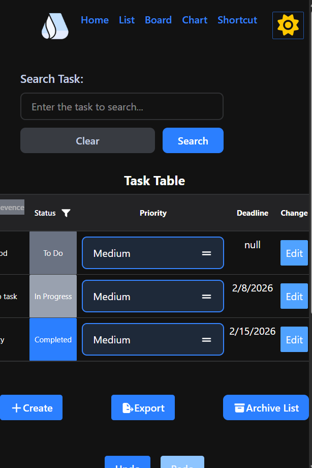

# My Project Managment like Jira Project React:
  -  Project Started: 2026/01/08
  
# stack i've used:
  - Tailwindcss.
  - React
  - React Router
  - Context Api
  

# New Terminology that i've learned:
- When we do: `arr.slice(0, -1)` it'll remove the last index value and return the new value.
- i've forgetten the syntax of: `parseInt` convert to the integar of string.
- Nullis cohersion i've forgetten: `val ?? 9` mean if val is undefined/null use 9 o r else use val.
- if we want the direct return on the jsx: we can do with like this way: `export ()=>()` it become a export with can write all return statement on this ().
- `whitespace-nowrap` make on single line not go on next line style
- `startCase(camelCase(val))` Convert any value to the CamelCase with the StartCase 
- `text-zinc-500` it's also the option on color that we cna use.
- for finding the single list i must use find while for the multiple list i've to use the .find

# Some syntax that i've forgetten or issue that i've fixed which i myself fix.:
  - how to make the default value not showing or hiding on select option.
  - I've use the onSubmit instead of onClick on the form which trigger a problem.
  - Unable to track the single selection on the table rather selected all fix
  - Also unable to do the event delegation on the parent.
  - Make the default value of the input
  - Make the event delegation is user is cick outside not showa input button
  - Controlled input default input value fix.
  - during the setLocalStorage hoooks, i've facwe as soon as it's rerender that function it setting duplicate values.
    - It's due to the prev spread operator
  - as i've face the duplicate entreis, which i can solve with the check on array which have duplicate just update that.
  - i'm doing the overenginneing on the filter option which i fix now.
  - i'm facing that it shows the object but it's the array which i'm unable to access the . property.  
  >:white_check_mark: I should pass the header comps to the main inside router not on the render.
    - Lot of error on the drag and drop.
  - During convert to static to localStorage value, i've face lot of error on naming and the toLoweCase()
  -  undo and redo of the rest operator getting the last value from the array.
- Have to face lot of erro on the undo and redo as it's my first times.
- - During the drag and drop from practice to real implementation: `min-h-screen-` causing my buttons to not showing up.
  ## More Error tha i'm facing:
    - i've used: `        redirect("/board")` which is not correct for redirect during the keyword shortcut.
    - i don't have to write the if: `if(e.ctrlKey==true)` as it's boolean it work without the true.
    - Also the index of showing homepage, which i've not make index of app.
    - The Stylying prolbem of the elipssis menu delete
    - the main problem is on when i make the updateResult, the currentValue is not guarented too be the array so i then check it fix now.
    - The colspan problem of not coming to the center of the page when list is empty.
    - During the sorting data problem, i've face a problem of not able to implement the sort by relevelancee, means go to the previous stage, which i done with the take temp variable and print that modify that not original.
  - During make a export feature i'm unable to separate the object for the csv format.
  - Also not line breaking not due to not spread the array.
  

  # Repsonsive Design:
    - Add the responsive design on the multiple page of the header, footer and also on the task th side
    - Lodash provide us to convert any valeu to the camelCase which i'm using.
    - The problem during the resposive design i'm still unable to make the flex-row of the list chart but small things have done.
    - Also make the responisve design on all pages such as chart, list, keyword shortcut.

# Features:
  - User input
  - show on table
  - can edit the option
  - Also can cancel the option
  - make on the grid layout
  - currently implementing the feature option
  - Now implement the filter option now currently implementing the search feturea.
  - Now i've also add the 
  - Can change the priority of task of easy, medium and hard, 
  - I've make the Option priorty more robust add with the localStorage, each list
  - Implement the react router, as of now three router successfully created with also the header.
  - Make Separate Drag and drop view.
  - Finally able to implement the drag and drop feature.
  - Also add like instant update with the localstorage.
  - For the undo and the redo operation, rather i've create the new history, i've get online that i can create the three state of past, present and future based on that i can change it.
  - Implement the undo, redo feateure on the 13/1, also make the custom hooks for that, with lot of error.
  - Start implementing keyword shortcut for the project.
  - Have the keyword shortcut cheatlist on the separate comps, user can go on that, with the `control+?` or header bar option.
   - Implemen the full keyword shortcut: 01/16
  - Also add the menu eplipsis  with the delete feature.
  - User can create the new task with the button by default it'll not show the input page.
  - Adding the Deadline Date which will become the optional
  - Write the custom message for the user new TaskInput.
  - Make center of page of colspan when length is 0
  - Add the Deadline time, feature to the project"
  - Implement the Sorting feature with Ascending, Descending, Default and the Deadline, with take another temporary variable where we use: `displayAllTasks` and if default is do nothing else, just spread the original data and sort that.
  - Also add the more sort by of, Priority, Status.
  - Add the React Label/Tags for the each task.
  - Finally Implement the Label tag with the hellp of the `react-select` Library
  - Show the option the user is previously selected.
  - Trying to implement the dark and light mode started
  - I've make basic setup  the Dark Light for the tailwindcss with the stack overflow just basic 3 steps rest i've done myself.
  - I've to setup the `tailwind.config.js`.
  - Move the Createbutton the separate page. 
  - Finally Successfully Implenent the Chart feature with pie chart, On the Separate chart comps, as well with on the homepage, Use two library to achieve it.
  - User Can extract the entire data on both 2 format of the json/csv format
  - Add the footer page
  - And also add the website logo
  - Add the featuer of the export of our data on csv and the json.
  - Make the repsonvive desing for the mobile friendly to every page, from the homapge, chart, list, shortcut, and also header, and footer.
  - Remove all the import hooks that i've used and also dummy data.
  - I've also implement the drag and drop undo chart view
  - add the Feature of the user can now pinned any task they want and show on homepage with data persist
  - Done code splitting of the page with the lazy loading.
  - Add the vercel anallytics library for get the stats of my visitor status.
  - Add the vercel.json for deploy on vercel

  # # Project ScreenShot:

  
  
  
  

  # My Own Usage that i can use on coming days.
  - I've make one Input, and button which are mostly used my own style:
    - Button: `opacitiy-85 cursor-pointer bg-blue-500 font-semibold  py-2 px-4 rounded m-2`
    - Input: `bg-transparent h-10 w-72 rounded-lg text-black placeholder-transparent ring-2 px-2 ring-gray-500 focus:ring-sky-600 focus:outline-none`
  - Instead of `gap-4` that we do on child element instead we should give: `space-4`    

  
  # Common Feature:
    - Add the Loading state for just react router
    - Also add the erorr page.

# Drag And Drop Feature:
  - For that i'm using the dnd library
  - I've to wrap e everything inside the dndContext.
  >:warning: I'm using the `closestCorners` algorithm on dndContext to identify which is dragged.
  - on the useDraggable, useDroppable both are hooks we've to pass the unique id with wrap on object.
  - as useDroppable msot used property is, setNodref we can destructre is
  - for the useDroppable is multiple of:
    - id is your task's unique id
    - setNodeRef → attach to the task's div
    - listeners → spread on the div (enables drag with mouse/touch)
    - attributes → accessibility stuff
    - transform → makes it visually move while dragging 
  - I've set the onDragEnd.
  - Have to import the {css} utlities to make the transform.
  - Also add the sensor which can work with keyword shortcut and mobile dragger 

## Context Api:
  - for that it's recommend to create a folder inside the src.
  - first we create `createContext` from the react librarty and wrap everything of out content to this `createContext.provider` component of children
  - now on `<createContext.Provider value={[]}>` what we pass the value will be a context which we can access on anywhere.
  - the createContext naming we give is: `dataContext`
  - for accessing just wrap: const [value]=`dataContext`
   - Now i've implement the tasks, setTAsks and wrap everything to the context api.
   

# First time undo redo mistakes and logic:
  - for that we can make the threee state: `past, present, future`,
  - now for the undo, we take a value from the past, and store on present,
  - for redo take from the furutre on present and update
  - for result add all 3.
  - the present is sinlge value while past and future are multiple
  - i've done lot of mistake during updation, have to look at the 2 tutorial and someitmes google and also multiple times chatgpt if i'm being honest
  - after 3rd try i'm able to get the depth but not fully about 70% get the knowdlge of how undo redo work, it's little bit complex for the beginner
  

  # Portal:
    - When we're tyring to make the popup feature on the react, we can wrap everything on the header or something within it
    -  but it's not the best, as the `zindex` and the `position` absolute parent can't be override by children
    - we use the `createPortal` that provided by react-dom
    - We will be create  new id beside the #root on html, and append our popup there.
    - Now we return the `createPortal` with wrap them on the `portal` dom id.
    

# Library Used:
  - tailwindcss
  - fontawesome
  - react-router
  - dnd-kit/core (for the drag and drop feature)
  - react-date-picker
  - react-select
  - chart.js
  - React-chartjs-2
  - Lodash
  - React Loader Spinner
  - Vercel Analytics

>:warning: When it says infinite rerender on the react it mainly due to the infinite render or not wrap out setter method on the useEffect, we've to give the depedancy array to stop rerendering every time as our state is changed.

## Post Maintainence:
  - Add the better Stylying When list  is empty on the homepage, and also the colspan problem: 01/22
  - Also add the cancel button, for the input field: 01/22
  - Fix the stylying f the draggable scrollab issue on the table when input is empty. 01/22
  - Sytle of the label bar, with als add the isLabel to the input field, and also make the auto focus with input cursor: text, 01/22  
  - With by Default isPinned by default is false, remove unnecesary props passing that i can get from the useConetxt. 01/22
  - Remove the separate Pinned from the contextBar. 01/22
  - Style the error page and with showing what the error really is, fix the stylye of the create and export. 01/22
  - Implement the Archive Features. 01/22
  - Add all the feature of the archive showing the list to delete task: 01/23
  - move to localStorage for data persistent on the archives. 01/23
  - Fix lot of spelling and structure issued on the `readme.md` file
  - Add the Project Screenshot about the output
  - make Better Folder Structuer with moving teh Pages to separate folder, and Also the Common to separate from Components and also fix the import Export error: 01/26
  - improve Footer Page.
  
